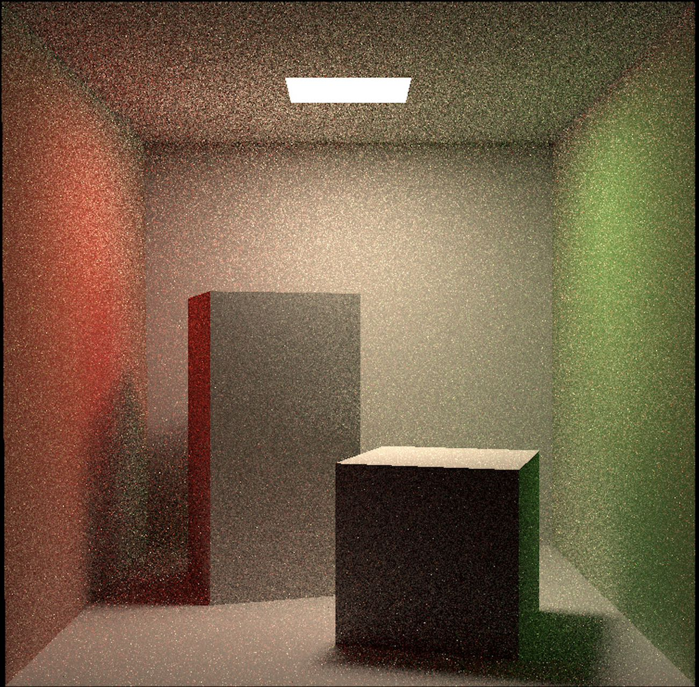

Hello, here is ZaychikLiu, welcome to my personal website! 

## 🎉Basic Infromation

My name is Feiyang Liu（刘飞扬）, I am a junior undergraduate majoring in Intelligent Science and Technologyat the School of Automation at South China University of Technology.（华南理工大学）

## 🔥News

* I am now searching for a long-term(2 semesters) internship in Berkeley, please contact me if you are interested!

## 📑Publications and Projects

### Publication

Not Publications yet, but I believe that if you are willing to cooperate with me, we can definitely produce good papers！

### Projects, interesting homework and gadgets

* **Real-time shadows**（Games 201）(Uploading code)

<video width="320" height="240" controls>
<source src="../images/Real_time_shadows.mp4" type="video/mp4">
</video>

* **Global ray tracing**(Games 201)(Yeah, my code is lost, crying.)

* **Angry Rabbit**(Games 103)

<video width="800" height="600" controls>
<source src="../images/Angry_Rabbit.mp4" type="video/mp4">
</video>

Try it [here](https://play.unity.com/en/games/a47ac486-884b-4806-8b31-3a7f1e729d4b/games-103-lab1)!

* **Cloth Simulation**(Games 103)

<video width="800" height="600" controls>
<source src="../images/Cloth_Simulation.mp4" type="video/mp4">
</video>

Try it [here](https://play.unity.com/en/games/d9ceed03-a643-4359-b235-5de12ea80a62/games103-lab2)!

* **Finite Element Simulation**(Games 103)

<video width="800" height="600" controls>
<source src="../images/Finite_Element_Simulation.mp4" type="video/mp4">
</video>

* **Water Wave Simulationt**(Games 103)

<video width="800" height="600" controls>
<source src="../images/Water_Wave_Simulationt.mp4" type="video/mp4">
</video>

Try it [here](https://play.unity.com/en/games/ae328e27-95a6-4d4c-9138-202887f3d5f6/games103-lab4)!

* **How to fit Mona Lisa with ellipses?**(Artificial Intelligence Course Design)

* **Rasterize Mavericks**(Games 101)

* **Bounding Volume Hierarchy**(Games 101)

* **Ray Tracing**(Games 101)

* **Cornell Box**(Games 101)

* 2022.11 - 2023.1 **Automatic classification and pricing of canteen dishes based on machine vision.**

<video width="320" height="240" controls>
<source src="../images/2.mp4" type="video/mp4">
</video>

<video width="320" height="240" controls>
<source src="../images/3.mp4" type="video/mp4">
</video>

<video width="320" height="240" controls>
<source src="../images/4.mp4" type="video/mp4">
</video>

<video width="320" height="240" controls>
<source src="../images/5.mp4" type="video/mp4">
</video>

* 2024.3 - 2024.9 **Gait Recognition(Outdoors Datasets)**（Try to modify, incomplete）

​		

​		

* 2023.7 - 2023.9  **Tencent Kaiwu Reinforcement Learning Competition.（preliminary round）**

​		

* 2023.1-2023.3 **WeChat chatbot using chatgpt interface**.(Unfortunately my account was banned by Tencent due to this bot.)
* 2023.5 - 2023.6 **CS231n**

​		

## 💻Internships and Research Experience

* 2024.3 - 2024.9 **Undergraduate Research**, Gait Recognition. Supervisor: [Wenxiong Kang](https://scholar.google.com/citations?user=meU7EOAAAAAJ&hl=en), [South China University of Techonology](https://www.scut.edu.cn/en/)
* 2024.4 - 2024.9 **Remote Intern**, Multimodal and Computer Graphics. Supervisor: [Shengfeng He](http://www.shengfenghe.com),[Singapore Management University](https://www.smu.edu.sg)
* ~~2024.7 - 2024.10 **Summer Intern**, Computer Graphics / Computer Vision. Supervisor [Wenping Wang](https://scholar.google.com/citations?user=28shvv0AAAAJ&hl=en),[Texas A&M University](https://en.wikipedia.org/wiki/Texas_A%26M_University)~~ Due to the time conflict, I have to give up this opportunity.(crying)

## 📖Education

* 2022.9 - now, Undergraduate student, South China University of Technology. (Project 985, a top 20 university in Chinese mainland)
* 2024.9 - now(I will stay for 1-2 years/ 2-4 semesters, welcome to come and communicate with me!) Visiting Student, Unibersity of California, Berkeley

### Current GPA: 

3.6

### Fun Courses:

* GAMES101: Introduction to Modern Computer Graphics(Online, University of California, Santa Barbara)
* GAMES102: Geometry Modeling and Processing(Online, University of Science and Technology of China)
* GAMES103: Introduction to Physics-Based Computer Animation(Online, Ohio State University)
* GAMES201: Advanced Physics Engines 2020: A Hands-on Tutorial(Still studing, it is really in-depth theory)(Online, Tachi Graphics)
* GAMES202: High-quality real-time rendering(One Part left)(Online, University of California, Santa Barbara)
* CS231n: Deep Learning for Computer Vision(Online, Stanford University)
* CS229: Machine Learning(Online, Stanford University)

### Courses in Berkeley

* CS61C: Great Ideas in Computer Architecture
* CS294/194-196: Large Language Model Agents
* MECENG 239/139: Robotic Locomotion

### Core courses in SCUT:

* Advanced Mathematics(4.0/4.0)
* Linear Algebra(4.0/4.0)
* Probability Theory and its Applications(4.0/4.0)
* C++ Advanced Programming(4.0/4.0)
* Data Structure(4.0/4.0)
* Pattern Recognition
* Introduction to Artificial Intelligence
* Numerical analysis
* Signals and Systems
* Complex function
* Integral Transform
* Digital electronic circuits
* Analog electronic circuits
* Circuit Basics
* Classical control theory
* Systems Engineering Theory
* Computer Internet
* And so on......

### Areas of Interest

* Computer Vision
* Computer Graphics
* 3D Reconstruction
* 3D Vision
* Diffusion Models
* Video Understanding
* Mutimodal
* SLAM

## 🥇Honors and Awards

* Members of the Visual Team of the Automation Innovation Practice Base
* SCUT Robot Association Vision Group Officer

## 🗒️Notes

> All written in Chinese

### 3D Vision
* [K-Planes](https://github.com/ZaychikLiu/MyNotes/blob/main/NeRF/K-Planes.pdf)
* [Instant NGP](https://github.com/ZaychikLiu/MyNotes/blob/main/NeRF/Instant%20NGP%E7%AC%94%E8%AE%B0.pdf)
* [Plenoxels](https://github.com/ZaychikLiu/MyNotes/blob/main/NeRF/Plenoxels%E7%AC%94%E8%AE%B0.pdf)
* [Neus](https://github.com/ZaychikLiu/MyNotes/blob/main/NeRF/Neus%E8%A7%A3%E8%AF%BB.pdf)
* [TensoRF](https://github.com/ZaychikLiu/MyNotes/blob/main/NeRF/TensoRF%E7%AC%94%E8%AE%B0.pdf)
* [VolSDF](https://github.com/ZaychikLiu/MyNotes/blob/main/NeRF/VolSDF%E7%AC%94%E8%AE%B0.pdf)
* [MipNeRF](https://github.com/ZaychikLiu/MyNotes/blob/main/NeRF/Mip-NeRF%E8%A7%A3%E8%AF%BB.pdf)
* [MipNeRF360](https://github.com/ZaychikLiu/MyNotes/blob/main/NeRF/MipNef-360%20.pdf)
* [DVGO](https://github.com/ZaychikLiu/MyNotes/blob/main/NeRF/DVGO%E7%AC%94%E8%AE%B0.pdf)
* [NeRF](https://github.com/ZaychikLiu/MyNotes/blob/main/NeRF/NeRF%20in%20the%20Wild.pdf)
* [PlenOctree](https://github.com/ZaychikLiu/MyNotes/blob/main/NeRF/PlenOctree%E7%AC%94%E8%AE%B0.pdf)
* [PointNet](https://github.com/ZaychikLiu/MyNotes/blob/main/Pontcloud/Point-net%E7%AC%94%E8%AE%B0.pdf)
* [PixelNeRF](https://github.com/ZaychikLiu/MyNotes/blob/main/NeRF/pixelNeRF.pdf)
* [NeRF++](https://github.com/ZaychikLiu/MyNotes/blob/main/NeRF/Nerf%2B%2B.pdf)
* [NeRF](https://github.com/ZaychikLiu/MyNotes/blob/main/NeRF/Nerf%E8%A7%A3%E8%AF%BB.pdf)

### LLM, VLM

* [CLIP and its skewers（up to 2022）](https://zhuanlan.zhihu.com/p/692670708)
* [End-to-End Object Detection with Transformers（DETR）Notes（ECCV 2020 best）](https://zhuanlan.zhihu.com/p/692287940)
* [Video Understanding Skewers](https://zhuanlan.zhihu.com/p/691597937)
* [Two-Stream Convolutional Networks for Action Recognition in Videos 2014](https://zhuanlan.zhihu.com/p/690574091)
* [Learning Transferable Visual Models From Natural Language Supervision Notes](https://zhuanlan.zhihu.com/p/690389102)
* [Swin Transformer: Hierarchical Vision Transformer using Shifted Windows Notes](https://zhuanlan.zhihu.com/p/689827844)
* [Semantic Segmentation Skewers Up to 2017](https://zhuanlan.zhihu.com/p/689545948)
* [Contrastive Learning Skewers](https://zhuanlan.zhihu.com/p/688908649)
* [Momentum Contrast for Unsupervised Visual Representation Learning Notes](https://zhuanlan.zhihu.com/p/688621472)
* [Masked Autoencoders Are Scalable Vision Learners Notes](https://zhuanlan.zhihu.com/p/688464941)
* [AN IMAGE IS WORTH 16X16 WORDS: TRANSFORMERS FOR IMAGE RECOGNITION AT SCALE（ViT）Notes](https://zhuanlan.zhihu.com/p/688235018)
* [Generative Adversarial Nets Notes](https://zhuanlan.zhihu.com/p/687966191)
* [Attention Is All You Need Notes](https://zhuanlan.zhihu.com/p/687710744)

> More notes can be found [here](https://github.com/ZaychikLiu/MyNotes).

## 🏠Address

North Campus, South China University of Technology, Tianhe District, Guangzhou City, Guangdong Province, China.
University of California, Berkeley

## 📧Contact

* Weixin: [ZaychikLiu](../images/xrcode.png)

* Zhihu: [Zaychik](https://www.zhihu.com/people/lfy-46-11-14)

* Email: [Gmail](mailto:a160130k@gmail.com)
